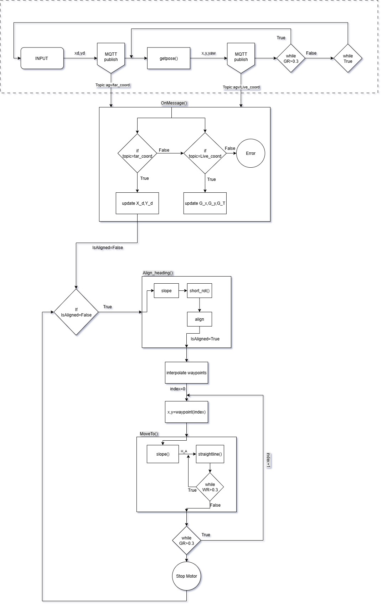

# AMR-Navigation-and-Digital-Twin
Developing a four-wheel Mecanum drive autonomous mobile robot for industrial material transport as part of a funded project. The system uses HTC Vive tracker–based localization for accurate indoor positioning and omnidirectional navigation.
# Demo: https://youtu.be/HPLmHtXh6Do

